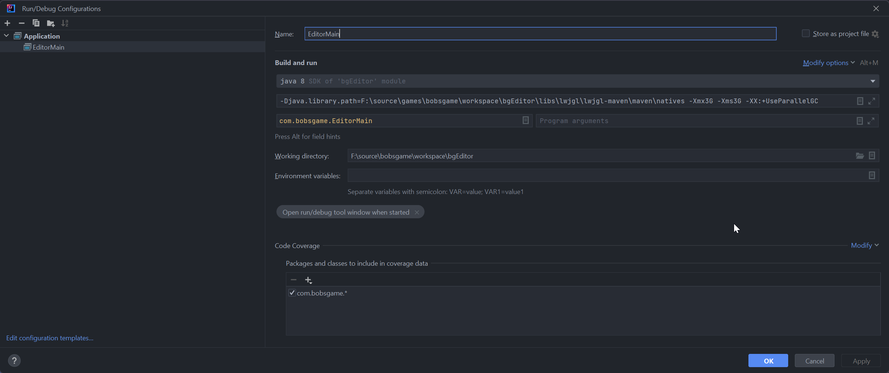

# bgEditor

Authors: Phil Kanaby, ok

See editor documentation in [docs/editor_docs.txt](./docs/editor_docs.txt)

## Building

1. Import this project into IntelliJ IDEA as a Maven project
2. Click the refresh icon on top right of the editor panel
3. On the right, click "Maven" then "Lifecycle" then "package"
4. Create a new run configuration on the top right with it being an "Application"
5. Name it "Editor" and click "Modify Options" and "Add JVM options"
6. Set the JVM options to `-Xmx3G -Xms3G -XX:+UseParallelGC`. Bob said you likely need 16GB ram to use it, but 3GB ram works just as good.
7. Set the main class to `com.bobsgame.EditorMain`
8. Apply then click "OK"

9. Click the run button on the top right and the editor will open.

## Exporting the Map

1. Clone the okWorldAssets repo from https://github.com/bobsgamed/okWorldAssets.git
2. Go to your editor and head to File > Open Project
3. Open the zip file in okWorldAssets
4. Wait a few minutes while the maps load.
5. Click on File > Export Project To ...
6. You may get a lot of errors informing you that sfx and bgm are missing. Don't worry about this right now as it still exported.
7. Exit via File > Exit (no autosave)
